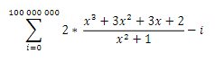

# Práctica Nro. 1

_Optimización de algoritmos secuenciales_ 

1. El  algoritmo  fib.c  resuelve  la  serie  de  Fibonacci,  para  un  número  N  dado,  utilizando  dos  métodos: recursivo  e  iterativo.  Analice  los  tiempos  de  ejecución  de ambos  métodos  ¿Cuál  es  más  rápido?  ¿Por qué? \
Nota: ejecute con N=1..50.  \

    1. Segun los tiempos de ejecución el más rapido es el método iterativo, puede ocurrir que con parametros pequeños menores a 10 el metodo iterativo pueda verse superado por el metodo recursivo, pero una vez se utilizan parametros superando los 10 se empieza a notar la diferencia en velocidad. \
    El metodo iterativo ocurre dentro de un for, mientras que el recursivo ocurre dentro de un procedimiento que se tendra que ejecutar N veces.

2. El algoritmo funcion.c resuelve, para un x dado, la siguiente sumatoria:  \
    El algoritmo compara dos alternativas de solución. ¿Cuál de las dos formas es más rápido? ¿Por qué?

    2. El tiempo de ejecución de la función calculada cada vez es mayor debido a que por cada iteración se calcula toda la expresión de la sumatoria en la variable de resultado, mientras que en el caso de la función calculada que solo realiza la expresión una vez y luego es referenciada en cada iteración del for.

3. El algoritmo instrucciones.c compara el tiempo de ejecución de las operaciones básicas: suma (+), resta 
(-), multiplicación (*) y división (/), para dos operandos dados x e y. ¿Qué análisis se puede hacer de 
cada operación? ¿Qué ocurre si x e y son potencias de 2? \
    3. Por cada operación se va a iterar 1M de veces realizando la operación, solamente se realiza la operación y se la asigna a la variable resultado. \
    En caso de operaciones con potencias de 2 puede resultar ser mas eficiente en divisiones y multiplicaciones(Segun fuentes confiables).

4. En  función  del  ejercicio  anterior  analice  el  algoritmo  instrucciones2.c  que  resuelve  una  operación 
binaria (dos operandos) con dos operaciones distintas.
    4. Ambas operaciones se realizan dentro del for al igual que en el ejercicio anterior, la diferencia recae en que la división se realiza con un entero(es 5 aunque este declarado con un double), la división entre "enteros" requiere menos recursos y ciclos de reloj, mientras que la multiplicación se realiza con un double (0.2), este tipo de operaciones requieren más ciclos de reloj y más recursos de computo.

5. Investigue  en  la  documentación  del  compilador  o  a  través  de  Internet  qué  opciones  de  optimización 
ofrece  el  compilador  gcc  (flag  O).  Compile  y  ejecute  el  algoritmo  matrices.c,  el  cual  resuelve  una 
multiplicación  de  matrices  de  NxN.  Explore  los  diferentes  niveles  de  optimización  para  distintos 
tamaños  de  matrices.  ¿Qué  optimizaciones  aplica  el  compilador?  ¿Cuál  es  la  ganancia  respecto  a  la 
versión sin optimización del compilador? ¿Cuál es la ganancia entre los distintos niveles?

    5.  **0**: Optimización por defecto (0 optimización).\

        **1, 2, 3**: Cuanto mayor sea el número, mayor sera el nivel optimización.\

        **S**: Optimizar el tamaño del archivo.\

        **fast**: Funciona similar al nivel 3, fast hace caso omiso del estricto cumplimiento de las normas para permitir optimizaciones adicionales.\

        **g**: Optimizar la experiencia de depuración. \

        (Fuentes access.redhat.com) \

        Dependiendo del código sera mas viable optimizar o no con el compilador. El rendimiento/eficiencia dependera mucho de la complejidad del código y del tamaño de este, el grado de eficiencia sera muy diferente si el código es simple y corto, incluso puede ser contraproducente utilizar un metodo de optimización en códigos de ese estilo. Ya en códigos de mayor complejidad puede resultar optimo (valga la redundancia) usar un optimizador en el compilador. 
