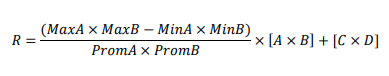

# Trabajo Práctico Nº 1   Optimización de algoritmos secuenciales

1. Resuelva el ejercicio 6 de la Práctica Nº 1 usando dos equipos diferentes: (1) cluster remoto y (2) equipo hogareño al cual tenga acceso (puede ser una PC de escritorio o una notebook).

    a. El  algoritmo  quadratic1.c  computa  las  raíces  de  esta  ecuación  empleando  los  tipos  de  datos float y double. Compile y ejecute el código. ¿Qué diferencia nota en el resultado? 

    - La diferencia radica en que ambos resultados varian en los últimos digitos, debido a que las soluciones **double** muchas veces son más precisas que las soluciones **float** que tendra una tendencia a redondear el resultado mientras mas cercano este al 0.

    b. El algoritmo quadratic2.c computa las raíces de esta ecuación, pero en forma repetida. Compile y ejecute el código variando la constante TIMES. ¿Qué diferencia nota en la ejecución?  

    - La diferencia que es notable es la reducción considerable del tiempo que toma el algoritmo para resolver las soluciones en Double y Float. Float siempre toma mas tiempo.
    En el caso de Times = 100 (Double = 48.584841 y Float = 52.846624), con Times = 10 (Double = 4.323746 y Float = 5.023306) y Times = 1 (Double = 0.467906 y Float = 0.477569)
    
    c. El algoritmo quadratic3.c computa las raíces de esta ecuación, pero en forma repetida. Compile y  ejecute  el  código  variando  la  constante  TIMES.  ¿Qué  diferencia  nota en  la  ejecución?  ¿Qué diferencias puede observar en el código con respecto a quadratic2.c? 

    -Al igual que en el inciso anterior, las diferencias al cambiar la constante TIMES reduce considerablemente el tiempo reuquerido para ambas soluciones. 
     - (TIMES = 100):
        Tiempo requerido solucion Double: 40.462592 
        Tiempo requerido solucion Float: 27.412683
     - (TIMES = 10):
        Tiempo requerido solucion Double: 4.029655 
        Tiempo requerido solucion Float: 2.728085
     - (TIMES = 1):
        Tiempo requerido solucion Double: 0.392069
        Tiempo requerido solucion Float: 0.264048
    A comparación con el inciso anterior, las soluciones tomen menos tiempo, ademas de que los valores A, B y C, se definen en constantes en **double** y en **float**. Supongo que se reduce el tiempo de ejecución ya que no es necesario pasar el valor de double a float, por ende al ya estar declarado como float en la constante y asignarlo a una variable hace que el algoritmo no se demore en realizar la conversión...

    //QUEDA LA EJECUCIÓN EN EL CLUSTER.

2. Desarrolle un algoritmo en el lenguaje C que compute la siguiente ecuación:
    - 
    - Donde A, B, C, D y R son matrices cuadradas de NxN con elementos de tipo double.
    - MaxA, MinA y PromA son los valores máximo, mínimo y promedio de la matriz A, respectivamente.
    - MaxB, MinB y PromB son los valores máximo, mínimo y promedio de la matriz B, respectivamente. 

    Mida el tiempo de ejecución del algoritmo en el cluster remoto. Las pruebas deben considerar la variación del tamaño de problema (N={512, 1024, 2048, 4096}). Por último, recuerde aplicar las técnicas de programación y optimización vistas en clase.

    2. Ya esta hecho el código, solo faltan las pruebas en el cluster y de paso probar con las opciones de optimización.